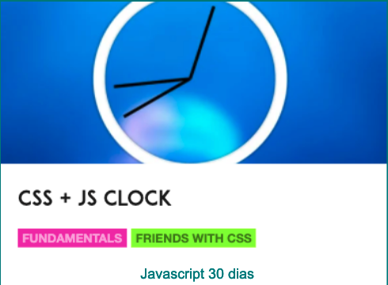

# Analogic Clock



## Desafio:

O objetivo é construir um relógio analógico tique-taque.

Você pode se desafiar de acordo com o seu nível de conhecimento, abaixo estão algumas das opções que você pode escolher para implementar este projeto:

- Se você está iniciando, você pode se desafiar desenvolvendo apenas o layout com CSS e HTML
- Além do passo anterior você pode usar o objeto `Date` do javascript sincronizar o seu relógio com o horário atual da sua máquina.
- Você pode substituir o Javascript por qualquer framework Javascript como Angular, VUE, React...
- Você pode usar uma linguagem híbrida como Flutter ou React Native

Se você acha que precisa ver uma solução antes de iniciar o desafio, deixamos os links abaixo para te apoiar, mas lembre-se você só aprende quando se desafia, tente ir além do que o desafio descreve e experimente sair da sua zona de conforto:

- [We build a CSS + JS Clock in Vanilla JS](https://www.youtube.com/watch?v=xu87YWbr4X0&list=PLu8EoSxDXHP6CGK4YVJhL_VWetA865GOH&index=2) : Esse vídeo mostra a solução apenas do javascript.
- [02 - JS and CSS Clock/](https://github.com/wesbos/JavaScript30/tree/master/02%20-%20JS%20and%20CSS%20Clock) : Nesse repositório está o código do HTML e CSS do desafio, mas lembre-se você pode usar uma imagem ou criar seu próprio relógio com CSS e HTML
- [Responsive analog clock using HTML, CSS and Vanilla JavaScript](https://www.geeksforgeeks.org/responsive-analog-clock-using-html-css-and-vanilla-javascript/?ref=rp) : Artigo explicando o como criar um relógio analógico responsivo
- [Create an Analog Clock using HTML, CSS and JavaScript](https://www.geeksforgeeks.org/how-to-create-analog-clock-using-html-css-and-javascript/?ref=rp) : Artigo explicando o como criar um relógio analógico

Ao finalizar seu desafio, adicione o link da sua aplicação na lista abaixo de exemplos de aplicações prontas:

- [simoneas02 /javascript30/apps/CSS-JS-Clock/](https://simoneas02.github.io/javascript30/apps/CSS-JS-Clock/)
- [talitaoliveira /js30/days/02-two/](https://talitaoliveira.com.br/js30/days/02-two/)
- [https://js-beginners.github.io/javascript30-css-and-js-clock/](https://js-beginners.github.io/javascript30-css-and-js-clock/)
- [kingrayhan /clock](https://kingrayhan.github.io/clock/)

Use a sua imaginação, escolha a linguagem de sua preferência e aproveite para praticar suas habilidades enquanto se diverte.

- Use o canal do slack para tirar dúvidas e/ou ajudar outras pessoas
- Coloque um rodapé na sua aplicação com seu nome e links do seu github, linkedin...
- Compartilhe sua solução com outras pessoas em sua rede social usando as nossas hashtags <3

```javascript
#wwcoderecifechallenges
#wwcoderecife
#wwcode
```

- **[Facebook](https://www.facebook.com/groups/wwcrecife)**
- **[Instagram](http://instagram.com/wwcoderecife)**
- **[Medium](https://medium.com/@karina_43953)**
- **[Twitter](https://twitter.com/WWCode_Recife)**
- **[LinkedIn](https://www.linkedin.com/company/women-who-code-recife)**

## Tem algum feedback para nós?

Adoramos receber feedback! Estamos sempre procurando melhorar nossos
desafios e nossa forma de interagir com a comunidade. Portanto, se você
tiver algo que gostaria de nos dizer, envie um e-mail para `recife@womenwhocode.com`

**Divirta-se construindo!** 🚀
