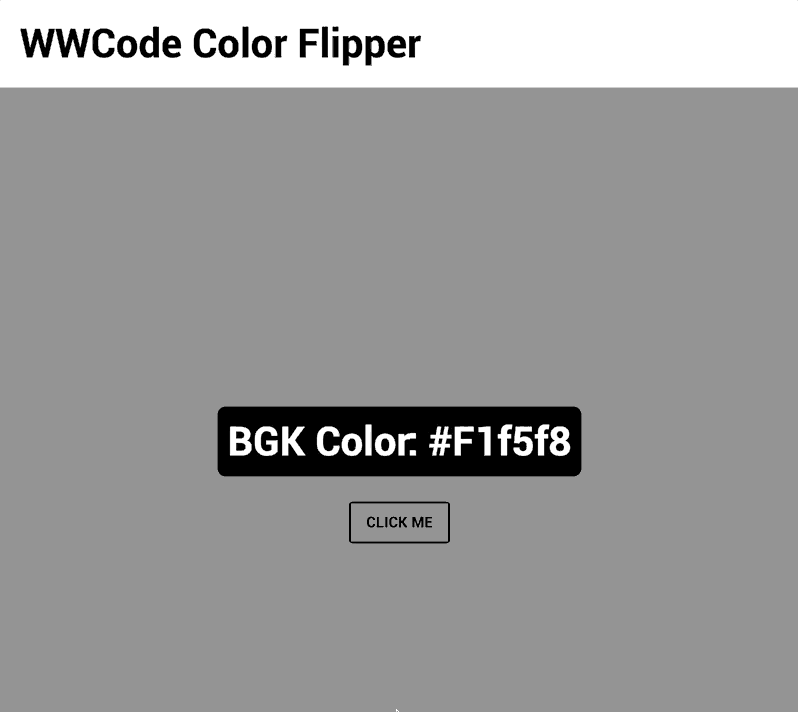

# WWCode Color Flipper

Neste desafio você aprenderá como criar um trocador de cor de fundo aleatório. Este é um bom
projeto para você começar a trabalhar com o DOM.

Ao manipular o DOM, você tem possibilidades infinitas. Você pode criar aplicativos que atualizam os
dados da página sem a necessidade de atualização. Além disso, você pode criar aplicativos
personalizáveis pelo usuário e, em seguida, alterar o layout da página sem uma atualização.

## Sugestão de estudos

- [DOM (Document Object Model) // Dicionário do Programador](https://www.youtube.com/watch?v=HOv9CqqAZk0)
- [Introduction to DOM - JavaScript Course #09](https://www.youtube.com/watch?v=WWZX8RWLxIk)
- [Manipulação de DOM com JavaScript, do zero, na prática | Masterclass #18](https://www.youtube.com/watch?v=UftSB4DaRU4)
- [Manipulando a DOM com Vanilla JS](https://www.youtube.com/watch?v=aVB67Y31E4A)
- [Entendendo o DOM (Document Object Model)](https://tableless.com.br/entendendo-o-dom-document-object-model/)
