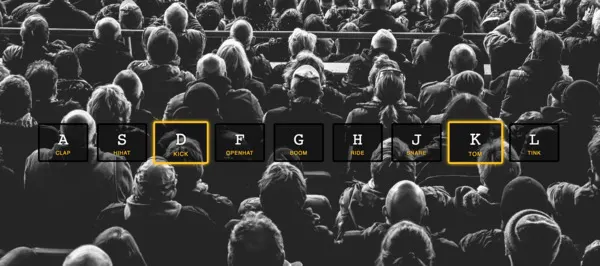

# Drum Kit



## Desafio:

O objetivo deste projeto é fazer com que cada tecla correspondente à letra, quando pressionada, acione um som de bateria correspondente.

Você pode se desafiar de acordo com o seu nível de conhecimento, abaixo estão algumas das opções que você pode escolher para implementar este projeto:

- Se você está iniciando, você pode se desafiar desenvolvendo apenas o layout com CSS e HTML
- Além do passo anterior você pode usar o javascript junto com a api do DOM para manipular os elementos e realizar a interação entre a tecla e o som
- Você pode substituir o Javascript por qualquer framework Javascript como Angular, VUE, React...
- Você pode usar uma linguagem híbrida como Flutter ou React Native

Se você acha que precisa ver uma solução antes de iniciar o desafio, deixamos os links abaixo para te apoiar, mas lembre-se você só aprende quando se desafia, tente ir além do que o desafio descreve e experimente sair da sua zona de conforto:

- [Make a JavaScript Drum Kit in Vanilla JS!](https://www.youtube.com/watch?v=VuN8qwZoego) : Esse vídeo mostra a solução apenas do javascript usando a API do DOM
- [01 - JavaScript Drum Kit/](https://github.com/wesbos/JavaScript30/tree/master/01%20-%20JavaScript%20Drum%20Kit) : Nesse repositório está o código do HTML e CSS do desafio, mas lembre-se você pode usar qualquer imagem e qualquer som pra fazer sua aplicação
- [Design a Drum-kit web app using JavaScript](https://www.geeksforgeeks.org/design-a-drum-kit-web-app-using-javascript/) : Artigo explicando o passo a passo para solucionar o desafio

Ao finalizar seu desafio, adicione o link da sua aplicação na lista abaixo de exemplos de aplicações prontas, pressione a tecla correspondente às letras para ver a aplicação funcionando:

- [simoneas02 /javascript30/apps/javaScrip-drum-kit/](https://simoneas02.github.io/javascript30/apps/javaScrip-drum-kit/)
- [talitaoliveira /js30/days/01-one/](https://talitaoliveira.com.br/js30/days/01-one/)
- [js-beginners.github.io/javascript30-drumkit](https://js-beginners.github.io/javascript30-drumkit/)
- [Arun / JavaScript Drum Kit](https://codepen.io/amdsouza92/pen/xdooWa)
- [kingrayhan /javascript-drum-kit](https://kingrayhan.github.io/javascript-drum-kit/)

Use a sua imaginação, escolha a linguagem de sua preferência e aproveite para praticar suas habilidades enquanto se diverte.

- Use o canal do slack para tirar dúvidas e/ou ajudar outras pessoas
- Coloque um rodapé na sua aplicação com seu nome e links do github, linkedin...
- Compartilhe sua solução com outras pessoas em sua rede social usando as nossas hashtags <3

```javascript
#wwcoderecifechallenges
#wwcoderecife
#wwcode
```

- **[Facebook](https://www.facebook.com/groups/wwcrecife)**
- **[Instagram](http://instagram.com/wwcoderecife)**
- **[Medium](https://medium.com/@karina_43953)**
- **[Twitter](https://twitter.com/WWCode_Recife)**
- **[LinkedIn](https://www.linkedin.com/company/women-who-code-recife)**

## Tem algum feedback para nós?

Adoramos receber feedback! Estamos sempre procurando melhorar nossos
desafios e nossa forma de interagir com a comunidade. Portanto, se você
tiver algo que gostaria de nos dizer, envie um e-mail para `recife@womenwhocode.com`

**Divirta-se construindo!** 🚀
