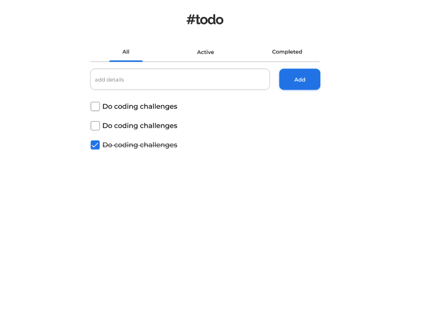

# TODO APP



Acesse [este link](https://www.figma.com/file/SClDA1weEGA3Mo8Is8Sbf2/todo?node-id=0%3A1) para visualizar o design do desafio

## Desafio:

- Criar uma aplicação para gerenciar sua lista de tarefas.
  - Estória do usuário:
    - Eu posso adiconar uma nova tarefa
    - Eu posso completar uma tarefa
    - Eu posso alternar entre as abas Todas, Ativas e Completadas
    - Eu posso remover uma ou todas as tarefas da aba Completadas
    - (opcional) Armazene os dados no localStorage para que, quando eu atualizar a página, eu ainda possa ver meu progresso
- Escolhe a linguagem de sua preferência e aproveite para praticar suas habilidades enquanto se diverte.
- Use o canal do slack para tirar dúvidas e/ou ajudar outras pessoas
- Coloque um rodapé com seu nome e links do github, linkedin...
- Compartilhe sua solução com outras pessoas no linkedin e instagram e marque a rede WWCode Recife 🥰

- Compartilhe em sua rede social usando as nossas hashtags <3

```javascript
#wwcoderecifechallenges
#wwcoderecife
#wwcode
```

- **[Facebook](https://www.facebook.com/groups/wwcrecife)**
- **[Instagram](http://instagram.com/wwcoderecife)**
- **[Medium](https://medium.com/@karina_43953)**
- **[Twitter](https://twitter.com/WWCode_Recife)**
- **[LinkedIn](https://www.linkedin.com/company/women-who-code-recife)**

## Tem algum feedback para nós?

Adoramos receber feedback! Estamos sempre procurando melhorar nossos
desafios e nossa forma de interagir com a comunidade. Portanto, se você
tiver algo que gostaria de nos dizer, envie um e-mail para `recife@womenwhocode.com`

**Divirta-se construindo!** 🚀
