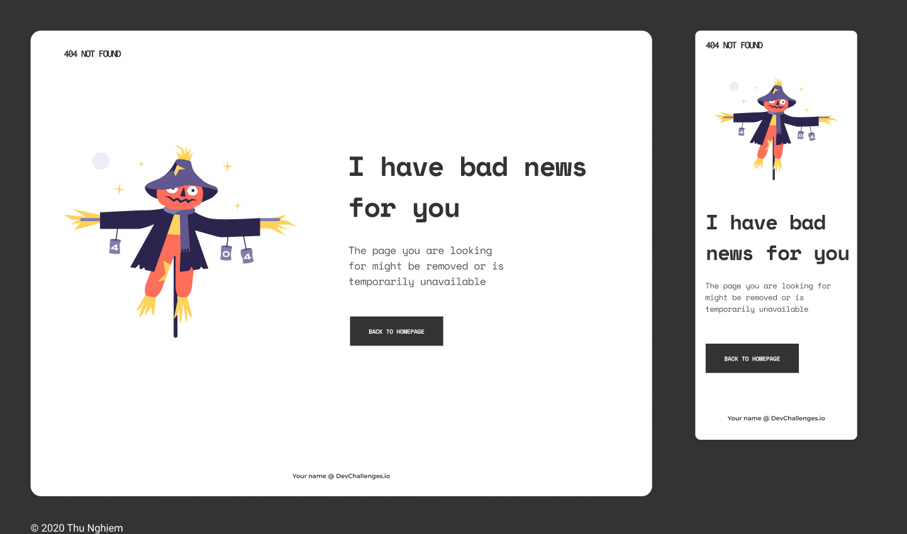

# ❌  Página 404



## Desafio:

- Criar uma página 404 (página não encontrada) seguindo o design acima, a página deve ser responsiva.
  -  História do usuário: posso ver uma página seguindo o design fornecido
- Use HTML semântico
- Use flexbox ou grid
- Escolha as cores e estilos de sua preferências
- Escolha a imagem para sua página
- Coloque seu nome no rodapé e links do github, linkedin...
- Compartilhe sua solução com outras pessoas no linkedin e instagram e marque a rede WWCode Recife 🥰
    - **[Facebook](https://www.facebook.com/groups/wwcrecife)**
    - **[Instagram](http://instagram.com/wwcoderecife)**
    - **[Medium](https://medium.com/@karina_43953)**
    - **[Twitter](https://twitter.com/WWCode_Recife)**
    - **[LinkedIn](https://www.linkedin.com/company/women-who-code-recife)**

- Compartilhe em sua rede social usando as nossas hashtags <3
```javascript
#wwcoderecifechallenges
#wwcoderecife
#wwcode
```

## Tem algum feedback para nós?
Adoramos receber feedback! Estamos sempre procurando melhorar nossos 
desafios e nossa forma de interagir com a comunidade. Portanto, se você 
tiver algo que gostaria de nos dizer, envie um e-mail para `recife@womenwhocode.com`

**Divirta-se construindo!** 🚀
